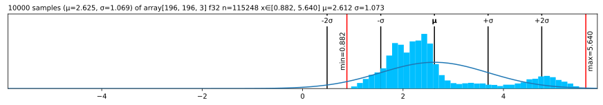
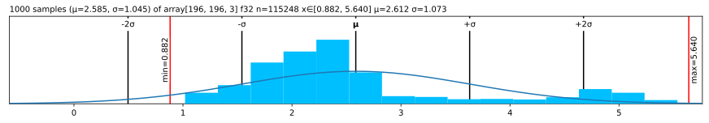
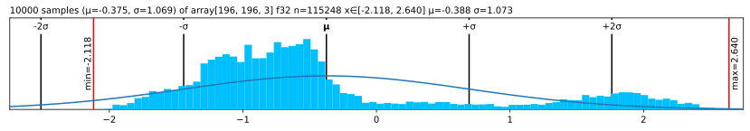
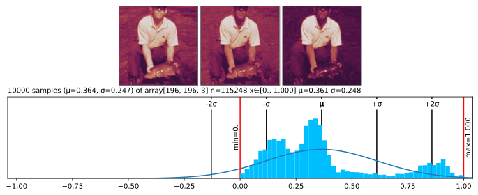

💟 Lovely NumPy
================

<!-- WARNING: THIS FILE WAS AUTOGENERATED! DO NOT EDIT! -->

<div>

## [Read full docs](https://xl0.github.io/lovely-numpy) \| ❤️ [Lovely Tensors](https://github.com/xl0/lovely-tensors) \| 💘 [Lovely `JAX`](https://github.com/xl0/lovely-jax) \| [Discord](https://discord.gg/4NxRV7NH)

</div>

## Install

``` sh
pip install lovely-numpy
```

or

``` sh
conda install -c conda-forge lovely-numpy
```

## How to use

How often do you find yourself debugging NumPy code? You dump your
variable to the cell output, and see this:

``` python
numbers
```

    array([[[-0.3541, -0.1975, -0.6715],
            [-0.3369, -0.1975, -0.9853],
            ...,
            [-0.4739, -0.3725, -0.689 ],
            [ 2.2489,  2.4111,  2.396 ]],

           [[-0.4054, -0.25  , -0.7238],
            [-0.4226, -0.2325, -1.0724],
            ...,
            [-0.8507, -0.6702, -1.0201],
            [ 2.1633,  2.3585,  2.3263]],

           ...,

           [[-0.8507, -0.3901, -1.1944],
            [-0.7822, -0.2325, -1.4559],
            ...,
            [-1.5014, -1.2304, -1.4733],
            [ 2.1804,  2.4111,  2.4308]],

           [[-0.8335, -0.4076, -1.2293],
            [-0.8164, -0.285 , -1.5256],
            ...,
            [-1.5528, -1.2829, -1.5256],
            [ 2.1119,  2.341 ,  2.3611]]], dtype=float32)

Was it really useful for you, as a human, to see all these numbers?

What is the shape? The size?  
What are the statistics?  
Are any of the values `nan` or `inf`?  
Is it an image of a man holding a tench?

``` python
from lovely_numpy import lo
```

## <code>Lo</code> and behold!

``` python
lo(numbers)
```

    array[196, 196, 3] f32 n=115248 x∈[-2.118, 2.640] μ=-0.388 σ=1.073

Better, eh?

``` python
lo(numbers[1,:6,1]) # Still shows values if there are not too many.
```

    array[6] f32 x∈[-0.408, -0.232] μ=-0.340 σ=0.075 [-0.250, -0.232, -0.338, -0.408, -0.408, -0.408]

``` python
spicy = numbers[0,:12,0].copy()

spicy[0] *= 10000
spicy[1] /= 10000
spicy[2] = float('inf')
spicy[3] = float('-inf')
spicy[4] = float('nan')

spicy = spicy.reshape((2,6))
lo(spicy) # Spicy stuff
```

    array[2, 6] f32 n=12 x∈[-3.541e+03, -3.369e-05] μ=-393.776 σ=1.113e+03 +Inf! -Inf! NaN!

``` python
lo(np.zeros((10, 10))) # A zero array - make it obvious
```

    array[10, 10] all_zeros

``` python
lo(spicy, verbose=True)
```

    array[2, 6] f32 n=12 x∈[-3.541e+03, -3.369e-05] μ=-393.776 σ=1.113e+03 +Inf! -Inf! NaN!
    array([[-3540.5432,    -0.    , ...,        nan,    -0.4054],
           [   -0.4226,    -0.4911, ...,    -0.5424,    -0.5082]],
          dtype=float32)

## Going `.deeper`

``` python
lo(numbers.transpose(2,1,0)).deeper
```

    array[3, 196, 196] f32 n=115248 x∈[-2.118, 2.640] μ=-0.388 σ=1.073
      array[196, 196] f32 n=38416 x∈[-2.118, 2.249] μ=-0.324 σ=1.036
      array[196, 196] f32 n=38416 x∈[-1.966, 2.429] μ=-0.274 σ=0.973
      array[196, 196] f32 n=38416 x∈[-1.804, 2.640] μ=-0.567 σ=1.178

``` python
# You can go deeper if you need to
lo(numbers[:3,:4]).deeper(2)
```

    array[3, 4, 3] f32 n=36 x∈[-1.125, -0.197] μ=-0.563 σ=0.280
      array[4, 3] f32 n=12 x∈[-0.985, -0.197] μ=-0.487 σ=0.259
        array[3] f32 x∈[-0.672, -0.197] μ=-0.408 σ=0.197 [-0.354, -0.197, -0.672]
        array[3] f32 x∈[-0.985, -0.197] μ=-0.507 σ=0.343 [-0.337, -0.197, -0.985]
        array[3] f32 x∈[-0.881, -0.303] μ=-0.530 σ=0.252 [-0.405, -0.303, -0.881]
        array[3] f32 x∈[-0.776, -0.303] μ=-0.506 σ=0.199 [-0.440, -0.303, -0.776]
      array[4, 3] f32 n=12 x∈[-1.072, -0.232] μ=-0.571 σ=0.281
        array[3] f32 x∈[-0.724, -0.250] μ=-0.460 σ=0.197 [-0.405, -0.250, -0.724]
        array[3] f32 x∈[-1.072, -0.232] μ=-0.576 σ=0.360 [-0.423, -0.232, -1.072]
        array[3] f32 x∈[-0.968, -0.338] μ=-0.599 σ=0.268 [-0.491, -0.338, -0.968]
        array[3] f32 x∈[-0.968, -0.408] μ=-0.651 σ=0.235 [-0.577, -0.408, -0.968]
      array[4, 3] f32 n=12 x∈[-1.125, -0.285] μ=-0.631 σ=0.280
        array[3] f32 x∈[-0.828, -0.303] μ=-0.535 σ=0.219 [-0.474, -0.303, -0.828]
        array[3] f32 x∈[-1.125, -0.285] μ=-0.628 σ=0.360 [-0.474, -0.285, -1.125]
        array[3] f32 x∈[-1.020, -0.390] μ=-0.651 σ=0.268 [-0.542, -0.390, -1.020]
        array[3] f32 x∈[-1.003, -0.478] μ=-0.708 σ=0.219 [-0.645, -0.478, -1.003]

## Now in `.rgb` color

The important queston - is it our man?

``` python
lo(numbers).rgb
```


*Maaaaybe?* Looks like someone normalized him.

``` python
in_stats = ( (0.485, 0.456, 0.406),     # mean 
             (0.229, 0.224, 0.225) )    # std

# numbers.rgb(in_stats, cl=True) # For channel-last input format
lo(numbers).rgb(denorm=in_stats)
```


It’s indeed our hero, the Tenchman!

## See the `.chans`

``` python
# .chans will map values betwen [-1,1] to colors.
# Make our values fit into that range to avoid clipping.
mean = np.array(in_stats[0])
std = np.array(in_stats[1])
numbers_01 = (numbers*std + mean).clip(0,1)
lo(numbers_01)
```

    array[196, 196, 3] n=115248 x∈[0., 1.000] μ=0.361 σ=0.248

``` python
lo(numbers_01).chans
```


## Grouping

``` python
# Make 8 images with progressively higher brightness and stack them 2x2x2.
eight_images = (np.stack([numbers]*8) + np.linspace(-2, 2, 8)[:,None,None,None])
eight_images = (eight_images
                     *np.array(in_stats[1])
                     +np.array(in_stats[0])
                ).clip(0,1).reshape(2,2,2,196,196,3)
            
lo(eight_images)
```

    array[2, 2, 2, 196, 196, 3] n=921984 x∈[0., 1.000] μ=0.382 σ=0.319

``` python
lo(eight_images).rgb
```


## Histogram

``` python
lo(numbers+3).plt
```



``` python
lo(numbers+3).plt(center="mean", max_s=1000)
```



``` python
lo(numbers+3).plt(center="range")
```


## Options \| [Docs](03d_utils.config.html)

``` python
from lovely_numpy import set_config, config, lovely
```

``` python
set_config(precision=5, sci_mode=True, color=False)
lo(np.array([1.,2,np.nan]))
```

    array[3] μ=1.50000e+00 σ=5.00000e-01 NaN! [1.00000e+00, 2.00000e+00, nan]

``` python
set_config(precision=None, sci_mode=None, color=None) # None -> Reset to defaults
lo(np.array([1.,2,np.nan]))
```

    array[3] μ=1.500 σ=0.500 NaN! [1.000, 2.000, nan]

``` python
# Or with config context manager.
with config(sci_mode=True):
    print(lo(np.array([1,2,3])))

print(lo(np.array([1,2,3])))
```

    array[3] i64 x∈[1, 3] μ=2.000e+00 σ=8.165e-01 [1, 2, 3]
    array[3] i64 x∈[1, 3] μ=2.000 σ=0.816 [1, 2, 3]

## Default `str` and `repr`

``` python
set_config(repr=lovely)
print(np.array([1, 2, 3])) # Note: print() calls str(). Cell output is repr()
print(repr(np.array([1, 2, 3]))) # See docs if you want to only set `repr`` or `str``
```

    array[3] i64 x∈[1, 3] μ=2.000 σ=0.816 [1, 2, 3]
    array[3] i64 x∈[1, 3] μ=2.000 σ=0.816 [1, 2, 3]

``` python
lo(np.array([1, 2, 3])).p # To see the plain values
```

    array([1, 2, 3])

## Without <code>Lo</code>

``` python
from lovely_numpy import rgb, chans, plot
```

``` python
lovely(numbers) # Returns `str`, that's why you see ''.
# Note:  lo(x) returns a wrapper object with a `__repr__` and other methods.
```

    'array[196, 196, 3] f32 n=115248 x∈[-2.118, 2.640] μ=-0.388 σ=1.073'

``` python
rgb(numbers, denorm=in_stats)
```


``` python
chans(numbers*0.3+0.5)
```


``` python
plot(numbers)
```



## Matplotlib integration \| [Docs](matplotlib.html)

``` python
lo(numbers).rgb(in_stats).fig # matplotlib figure
```


``` python
lo(numbers).plt.fig.savefig('pretty.svg') # Save it
```

``` python
!file pretty.svg; rm pretty.svg
```

    pretty.svg: SVG Scalable Vector Graphics image

``` python
fig = plt.figure(figsize=(8,3))
fig.set_constrained_layout(True)
gs = fig.add_gridspec(2,2)
ax1 = fig.add_subplot(gs[0, :])
ax2 = fig.add_subplot(gs[1, 0])
ax3 = fig.add_subplot(gs[1,1:])

ax2.set_axis_off()
ax3.set_axis_off()

lo(numbers_01).plt(ax=ax1)
lo(numbers_01).rgb(ax=ax2)
lo(numbers_01).chans(ax=ax3);
```


